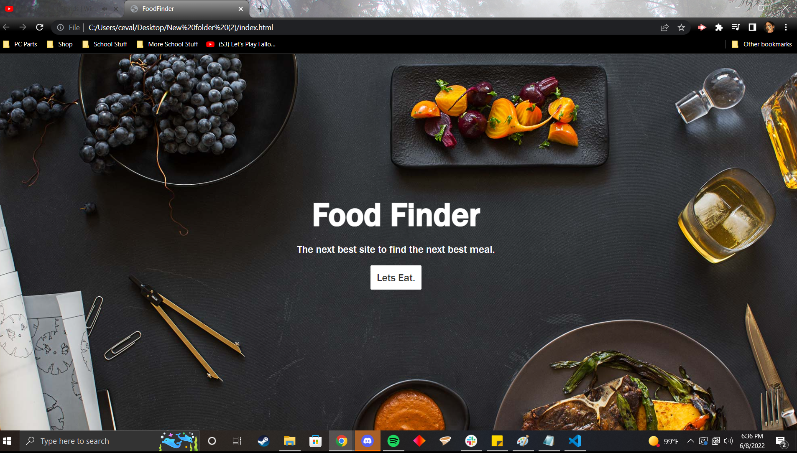

# Group projects
Food Finder
 
 Description
 application that is able to find nearby restuarants based off zip code and address, users need to be able to select what kind of food they want, when food place come up their rating also does. Created using HTML/CSS, JS aswell as api found online.

User Story

-AS A User who is searching for food
I WANT to be able yo find nearby restuarants/fastfood by inputting my location
SO THAT i can find a place to eat

